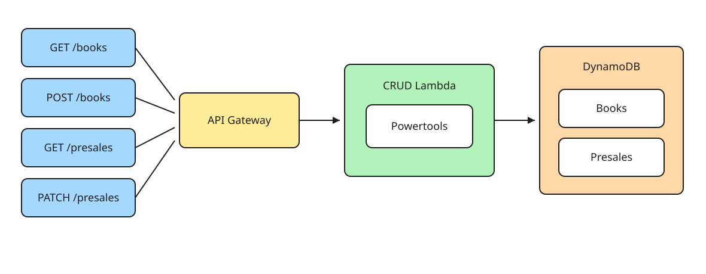

# Bookstore

Every request hits API Gateway, and API Gateway forwards all of them to one Lambda. Inside that Lambda, Powertools looks at the path and method and runs the matching CRUD function. boto3 reads and writes DynamoDB.

Powertools and `table_repository.py` live in a Lambda layer. AWS mounts that zip at `/opt/python`. The Crud zip only has the routes, the book and presale repositories, and the request models. `from table_repository import TableRepository` resolves from the layer.

## Books

| PK | Fields |
|---|---|
| `id` | `authorId`, `authorName`, `title`, `status`, `publishedAt`, `isFavorite` |

`authorId` identifies one person. `authorName` is only the name written on the book. Two people can share a name. A search for "Ana García" then returns every book with that name, including books from both people. `authorId` keeps them apart: `byAuthor` with one id returns only that person's books.

`status` describes the book itself.

- `PRESALE`: the author published it, and it is not in the store yet. A user can reserve it.
- `IN_STORE`: the book has arrived at the store.

## Presales

| PK | SK | Fields |
|---|---|---|
| `userId` | `bookId` | `status` |

`status` describes one user's reservation.

- `WAITING`: the user reserved the book and is still waiting.
- `ARRIVED`: that reservation is done. The book arrived, and the user should be notified.

## Indexes

| Index | Table | PK | SK | Answers |
|---|---|---|---|---|
| `byAuthor` | Books | `authorId` | `publishedAt` | Which books did this author publish? You already have the id. |
| `byAuthorName` | Books | `authorName` | `publishedAt` | Which books match this name? You only know the name. |
| `byBook` | Presales | `bookId` | | Who reserved this book? |
